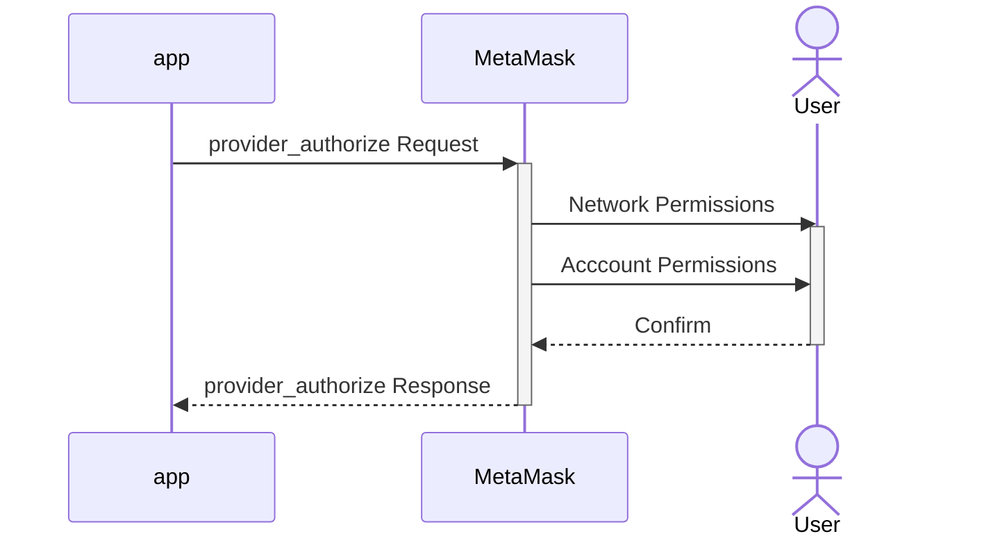

## Summary

A proposal to introduce an unrestricted `provider_authorize` method for applications to connect to MetaMask per ChainAgnostic Standards Alliance’s CAIP-25 standard. The `provider_authorize` method establishes an interface for permissioning application access to wallet-managed resources including accounts, RPC providers, and specific JSON-RPC methods across multiple chains (EVM and beyond) in a concurrent session. An application can request access to these resources by specifying scopes as defined in CAIP-217.

This method is intended to be part of a new version of the MetaMask Wallet API that is optimized for multichain interactions.

This proposal aims to implement CAIP-25's JSON-RPC Provider Authorization into MetaMask. For EVM (eip155) networks, the `rpcEndpoints` parameter is adapted to be compliant with the object structure defined in EIP-3085. Designing the interface in this way will provide a standardized approach for dApps to request access to networks and JSON-RPC methods.

## Motivation

The purpose of this proposal is to offer a convenient and standard interface for performing an initial handshake with a version of MetaMask that is designed for simultaneous interactions across multiple chains. 

The `provider_authorize` method is specifically meant to:

- Generally improve application-to-wallet interface negotiation
- Initiate multichain account and network connections
- Precisely negotiate an initial set of permissions with MetaMask

By adopting the CAIP-25 standard from the ChainAgnostic Standards Alliance to accomplish this, MetaMask can encourage industry interoperability while building a unique and powerful multichain experience.

General motivations for introducing a multichain-optimized Wallet API include:

- Reducing friction when interacting across different chains (both in dApps and MetaMask)
- Simplifying development for dApp builders
- Aligning MetaMask with community standards to simplify integrations and tooling in the ecosystem
- Increasing MetaMask's utility as a multichain wallet

This proposal is fundamental to evolving MetaMask to support a safe and intuitive experience when interacting with multichain dapps. Supporting a breadth of interactions across these chains, while retaining a logical developer and end-user experience, promises to unlock further ecosystem growth.

## Usage Example

### Request
An example of a typical JSON-RPC request that an application would send to request authorization(s) from a provider:

```js
{
  "id": 1,
  "jsonrpc": "2.0",
  "method": "provider_authorize",
  "params": {
    "optionalScopes":{ /* only emphasize optionalScopes, indicate that required scopes are possible elsewhere */
        "eip155:1":{
            "methods":["eth_sendTransaction","eth_getBalance","eth_blockNumber","eth_getTransactionCount","wallet_watchAsset"],
            "notifications":["message"],
            "rpcEndpoints":[{ /* these parameters are required for each rpcEndpoint */
                "chainName":"Ethereum (Infura)",
                "rpcUrls":["https://rpc.linea.build"], /* using an array only for future-proofing */
                "nativeCurrency":{
                    "name":"ETH"
                    "symbol":"ETH"
                    "decimals":18
                },
                "iconURLs":["https://example.com/ethereum.svg"] /* (Optional) using an array to allow */
            }],
        },
        "eip155:59144":{
            "methods":["eth_sendTransaction","eth_getBalance","eth_blockNumber","eth_getTransactionCount","wallet_watchAsset"],
            "notifications":["message"],
            "rpcEndpoints":[{ /*  these parameters are required for each rpcEndpoint */
                "chainName":"Linea (Infura)",
                "rpcUrls":["https://rpc.linea.build"], /* using an array only for future-proofing */
                "nativeCurrency":{
                "name":"ETH"
                "symbol":"ETH"
                "decimals":18
                },
                "iconURLs":["https://example.com/linea.svg"] /* (Optional) using an array to allow */
            }],
        },
        "wallet":{
            "methods":["wallet_requestPermissions","wallet_getPermissions","wallet_revokePermissions","eth_requestAccounts","eth_accounts","eth_signTypedData_v4","personal_sign","wallet_addEthereumChain"],
        },
    },
    "sessionProperties": {
      /* TBD - may be used to indicated that RPC endpoint may be different than what's in the CAIP-25 spec. */
    }         
  }
}
```

### Response
An example of the corresponding JSON-RPC response that an application would receive from the provider:

```js
{
  "id": 1,
  "jsonrpc": "2.0",
  "result": {
    "sessionId": "0xdeadbeef",
    "sessionScopes":{
      "eip155:1":{
        "methods": ["eth_sendTransaction", "eth_getBalance","eth_blockNumber","eth_getTransactionCount","wallet_watchAsset"],
        "notifications": ["message"],
        "accounts:" ["eip155:1:0x0910e12C68d02B561a34569E1367c9AAb42bd810"]
      },
      "eip155:59144":{
        "methods": ["eth_sendTransaction", "eth_getBalance","eth_blockNumber","eth_getTransactionCount","wallet_watchAsset"],
        "notifications": ["message"],
        "accounts":["eip155:59144:0x0910e12C68d02B561a34569E1367c9AAb42bd810"]
      },
      "wallet":{
        "methods": ["wallet_requestPermissions","wallet_getPermissions","wallet_revokePermissions", "eth_signTypedData_v4", "personal_sign", "wallet_addEthereumChain"]
      },
    },      
    "sessionProperties":{
      /* TBD */          
    }
  }
}
```


# Proposal

## Language
The key words "MUST", "MUST NOT", "REQUIRED", "SHALL", "SHALL NOT", "SHOULD", "SHOULD NOT", "RECOMMENDED", "NOT RECOMMENDED", "MAY", and "OPTIONAL" written in uppercase in this document are to be interpreted as described in RFC 2119.

## Definitions

**Wallet API**: [The interface](https://docs.metamask.io/wallet/concepts/apis/) that dapps can use to programmatically interact with MetaMask.

**Multichain API**: A version of the Wallet API that is optimized for interactions across multiple chains.

**Scope**: A uniquely identified domain for which authorizations can be applied (see [CAIP-217](https://github.com/ChainAgnostic/CAIPs/blob/main/CAIPs/caip-217.md) for further definition).

**Authorization**: A permission to use a resource. This term may be used interchangeably with the term **Permission**.

**eip155 scope**: A scope that applies to a particular EVM-compatible chain identified as specified in [CAIP-2](https://github.com/ChainAgnostic/CAIPs/blob/main/CAIPs/caip-2.md).

**wallet scope**: A scope that applies to capabilities that a MetaMask Wallet client can handle in a relatively self-contained way.

**chain**: A distributed ledger that can be targeted. It may or may not refer to a blockchain, which is a type of distributed ledger.  

**network**: An RPC network or node that enables interactions with a chain.


## Proposal Specification

### Implementing `provider_authorize`

- While `provider_authorize` will not be available through an EIP-1193 provider, the Multichain API Delivery MIP provides details about how to access the multichain API. 

- Authorization requests for both `wallet` and chain-specific scopes SHOULD generally be placed into `optionalScopes`. Use of `requiredScopes` will be supported but is NOT RECOMMENDED

- `chainId` uniquely indentifies the target chain, formatted as a string that includes both the namespace and the reference, following CAIP-2 conventions.
  
- `methods`, `notifications`, and `rpcEndpoints` are listed directly under each scope in line with CAIP-25.

- Additional metadata fields in `rpcEndpoints` SHOULD be compliant with the fields specified in EIP-3085.

[ TODO a PR in the api-spec repo describing the provider_authorize method in OpenRPC should be added here ]

#### Valid Scopes
Valid scopes SHALL include and will initially be limited to:
- `wallet`
- `eip155:X` (eip155 scope)

> **Note:** In the future, this specification may be extended to support Snap IDs or the full range of [CAIP-2 Namespaces](https://namespaces.chainagnostic.org/)

#### Wallet-Scope
##### Valid methods
See MetaMask’s rpcDocument for the most up-to-date specification of supported methods: https://metamask.github.io/api-specs/latest/openrpc.json

`wallet_switchEthereumChain` method WILL NOT be carried over to the Multichain API as chain switching coordination between dApp and wallet will no longer be necessary
`eth_sign`, `eth_signTypedData`, `eth_signTypedData_v3` methods WILL NOT be included in the Multichain API as these signature methods have been superseded by the more commonly used `personal_sign` and `eth_signTypedData_v4` methods

##### Valid notifications
`accountsChanged` - Because `provider_authorize` will return the accounts that the user authorized a dapp to interact with in the response, this notification is no longer necessary. The `accountsChanged` notification WILL NOT be included in the Multichain API.

#### eip155:X Scope
##### Valid methods
See MetaMask’s rpcDocument for the most up-to-date specification of supported Ethereum methods: https://metamask.github.io/api-specs/latest/openrpc.json

The `eth_accounts` and `eth_chainId` methods are no longer necessary and will not be included in the Multichain API.

##### Valid notifications
`message` - dApps can register to be notified of network-triggered notifications

##### Valid rpcEndpoints
When a MetaMask user does not have an existing network configured for a given eip155 chainId, including rpcEndpoints in the [scopeObjects](https://github.com/ChainAgnostic/CAIPs/blob/main/CAIPs/caip-217.md) will trigger MetaMask to suggest that the user add the first endpoint in the list. MetaMask expects rpcEndpoints to conform with the [EIP-3085](https://eips.ethereum.org/EIPS/eip-3085) standard. No action is taken if the user already has a network configured for the chainId.

### Error Handling
The error-handling behavior will follow CAIP-25 guidelines. If the wallet (MetaMask in this case) does not support the blockchain namespace or reference, or if any of the specified permissions are not supported, an error message will be returned.

## Rationale
By incorporating CAIP-25 and EIP-3085 standards, this proposal aims to provide a comprehensive and standards-friendly way for dApp developers to request wallet permissions in a multichain context. The `provider_authorize` method will also enable an intuitive connection experience for users who wish to interact with dApps across multiple chains using MetaMask. Developers can choose to either request permissions upfront or to request them progressively according to their needs.

## Test Cases
Test cases should cover:
- Successful provider_authorize requests with expected permissions returned in the response.
- Error handling when an unsupported scope object or permission is requested
- Error handling when the user denies consent for requested methods
- Error handling when the user denies all requested or any required scope objects
  
## Implementation
Implementing this proposal involves a significant modification to MetaMask's JSON-RPC request-handling code to support the new `provider_authorize` method, adjustments to the permissioning system, and updates to the UI components for user consent and management of dapp permissions.

## Developer Adoption Considerations

[Explain any considerations that developers should take into account when adopting this proposal. For example, how will it affect compatibility, and what changes may need to be made to accommodate the proposal?]

Backward compatibility will be maintained through the existing Ethereum Provider API. However, the Multichain API WILL NOT be available through the existing Ethereum Provider API. Because many developers rely on third-party libraries to connect their dapps with wallets, a some mapping logic that allows them to keep their "single chain" code as-is while actually hitting the multichain API may facilitate more rapid adoption. 

Developers should expect most new improvements to the Wallet API to be delivered only though the multichain API, NOT the Ethereum Provider API.

## User Experience Considerations

Calling the `provider_authorize` method with `optionalScopes` that include any eip155 prefixed scopes will trigger the following sequence:



## Privacy Considerations
This proposal raises important privacy considerations, including the need to avoid data leaking and the challenge of obtaining genuine user consent. It underscores the importance of preserving user anonymity and the sensitivites involved in determining authorizations. Identifying and mitigating these issues is crucial for protecting user privacy during multichain interactions, prompting a careful evaluation of how best to balance functionality with privacy concerns.

## Security Considerations
This proposal is an opportunity to further incorporate the [principle of least privilege](https://en.wikipedia.org/wiki/Principle_of_least_privilege) in MetaMask.

The proposal also brings to light some security considerations critical to multichain interactions. These include the challenges of ensuring robust authentication and authorization and the importance that users understand the chain with which they are interacting. Identifying and addressing these issues is vital for safeguarding users against the evolving landscape of security threats in the blockchain ecosystem.

## Committed Developers
MetaMask Portfolio
MetaMask Bridge

## Open Issues
List of significant open issues that require resolution in order for this MIP to be ready to be moved to the `Review` stage
- Add OpenRPC specs for the provider_authorize method
- Confirm which existing methods are not going to included in the Multichain API
- Confirm how CAIP-25 will be extended to support rpcEndpoints that follow the structure specified in EIP-3085
- Determine whether API versioning should be incorporated into this MIP

## Copyright

Copyright and related rights waived via [CC0](../LICENSE).
