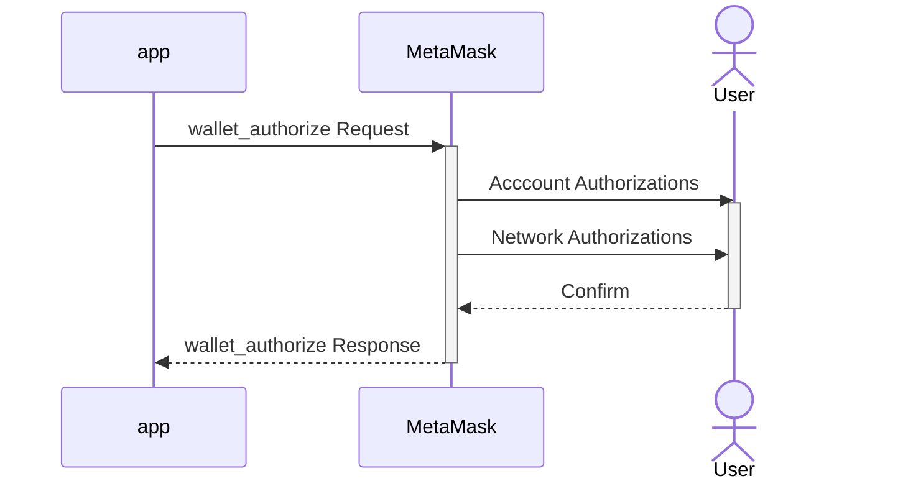

## Summary

A proposal to introduce an unrestricted `wallet_authorize` method for applications to connect to MetaMask per ChainAgnostic Standards Alliance’s CAIP-25 standard. The `wallet_authorize` method establishes an interface for authorizing application access to wallet-managed resources including accounts, RPC providers, and specific JSON-RPC methods across multiple EVM-compatible networks. An application can request access to these resources by specifying scopes as defined in CAIP-217.

This method is intended to be part of a new version of the MetaMask Wallet API that is optimized for multinetwork interactions.

This proposal aims to implement CAIP-25's JSON-RPC Wallet Authorization for EVM-compatible networks into MetaMask. For these networks, the `rpcEndpoints` parameter is adapted to be compliant with the object structure defined in EIP-3085. Designing the interface in this way will provide a standardized approach for applications to request access to networks and JSON-RPC methods.

## Motivation

The purpose of this proposal is to offer a convenient and standard pattern for applications to negotiate multiple network authorizations with MetaMask. 

The `wallet_authorize` method is specifically meant to:

- Allow applications to progressively negotiate a set of authorizations with MetaMask
- Generally improve application-to-wallet interface negotiation
- Initiate account and network connections

By adopting the CAIP-25 standard from the ChainAgnostic Standards Alliance to accomplish this, MetaMask can encourage industry interoperability while building a unique and powerful multinetwork experience. The `wallet_authorize` method will also enable an intuitive connection experience for users who wish to interact with applications across multiple networks using MetaMask. Developers can choose to either request permissions upfront or to request them progressively when they are needed. 

General motivations for introducing a Wallet API that is optimized for multiple networks include:

- Reducing friction when interacting across different networks (both in applications and MetaMask)
- Simplifying development for application builders
- Aligning MetaMask with community standards to simplify integrations and tooling in the ecosystem
- Increasing MetaMask's utility as a multinetwork wallet

This proposal is fundamental to evolving MetaMask to support a safe and intuitive experience when interacting with multinetwork applications. Supporting a breadth of interactions across these networks, while retaining a logical developer and end-user experience, promises to unlock further ecosystem growth.

## Usage Example

### Request
An example of a JSON-RPC request that an application would send to request authorization(s) from MetaMask:

```js
{
  "id": 1,
  "jsonrpc": "2.0",
  "method": "wallet_authorize",
  "params": {
    "optionalScopes": {
      "wallet": {
        "methods": ["wallet_scanQRCode"],
        "notifications": ["walletAuthorizationChanged]
      }
      "eip155:wallet": {
        "methods": ["eth_signTypedData_v4","personal_sign","wallet_addEthereumChain"],
        "notifications": ["accountsChanged"],
      }
      "eip155:1": {
        "methods": ["eth_sendTransaction","eth_getBalance","eth_blockNumber","eth_getTransactionCount","wallet_watchAsset"],
        "notifications": ["message"],
      },
      "eip155:59144": {
        "methods": ["eth_sendTransaction","eth_getBalance","eth_blockNumber","eth_getTransactionCount","wallet_watchAsset"],
        "notifications": ["message"],
      },
    },
    "scopeMetadata": {
      "eip155:1": {
        "rpcEndpoints": [{ 
          "chainName": "Ethereum (Infura)",
          "rpcUrls": ["https://mainnet.infura.io"],
          "nativeCurrency": {
              "name": "ETH"
              "symbol": "ETH"
              "decimals": 18
          },
          "iconURLs": ["https://example.com/ethereum.svg"] 
        }],  
      },
      "eip155:59144": {
        "rpcEndpoints": [{ 
          "chainName": "Linea (Infura)",
          "rpcUrls": ["https://rpc.linea.build"],
          "nativeCurrency": {
              "name": "ETH"
              "symbol": "ETH"
              "decimals": 18
          },
          "iconURLs": ["https://example.com/linea.svg"] 
        }],
      },
    },
  },
}
```

### Response
An example of the corresponding JSON-RPC response that an application would receive from the wallet:

```js
{
  "id": 1,
  "jsonrpc": "2.0",
  "result": {
    "sessionScopes": { 
      "wallet": {
        "methods": ["wallet_scanQRCode"],
        "notifications": ["walletAuthorizationChanged"]
      }   
      "eip155:wallet": {
          "methods": ["eth_signTypedData_v4","personal_sign","wallet_addEthereumChain"],
          "accounts": ["0x0910e12C68d02B561a34569E1367c9AAb42bd810"]
      },
      "eip155:1": {
        "methods": ["eth_sendTransaction", "eth_getBalance","eth_blockNumber","eth_getTransactionCount","wallet_watchAsset"],
        "notifications": ["message"],
        "accounts": ["eip155:1:0x0910e12C68d02B561a34569E1367c9AAb42bd810"]
      },
      "eip155:59144": {
        "methods": ["eth_sendTransaction", "eth_getBalance","eth_blockNumber","eth_getTransactionCount","wallet_watchAsset"],
        "notifications": ["message"],
        "accounts": ["eip155:59144:0x0910e12C68d02B561a34569E1367c9AAb42bd810"]
      },
    },      
  }
}
```

# Proposal

## Language
The key words "MUST", "MUST NOT", "REQUIRED", "SHALL", "SHALL NOT", "SHOULD", "SHOULD NOT", "RECOMMENDED", "NOT RECOMMENDED", "MAY", and "OPTIONAL" written in uppercase in this document are to be interpreted as described in RFC 2119.

## Definitions

**network**: Decentralized networks where control, validation, and decision-making processes are distributed across multiple nodes rather than centralized in a single entity. The term will refer to a specific decentralized network that has a single unique identifier. Networks may be implemented as a blockchain or another distributed ledger technology. 

**node**: An RPC node that facilitates interactions with a decentralized network.

**Wallet API**: [The JSON-RPC interface](https://docs.metamask.io/wallet/concepts/apis/) that applications can use to programmatically interact with MetaMask wallet clients.

**authorization**: A permission to use a resource. This term may be used interchangeably with the term **permission**.

**scope**: A uniquely identified domain for which authorizations can be applied (see [CAIP-217](https://github.com/ChainAgnostic/CAIPs/blob/main/CAIPs/caip-217.md) for further definition).

**wallet scope**: A scope that applies to capabilities that a MetaMask Wallet client can handle in a relatively self-contained way. They are not specific to a network or namespace.

**eip155:wallet scope**: A CAIP-2 identifier with a reserved `wallet` as the `reference`. For example "eip155:wallet" indicates a scope that is not specific to a particular Ethereum network but is related to the `eip155` `namespace`.

**eip155 scope**: A type of scope that applies to a particular EVM-compatible network. These networks are prefixed with the "eip155" `namespace` as defined in the [CASA namespace registry for EVM-compatible networks](https://github.com/ChainAgnostic/namespaces/tree/main/eip155).

**unrestricted method**: A JSON-RPC method that does not require an authorization to invoke.

**Multinetwork API**: A version of the Wallet API that is optimized for interactions across multiple networks.

**Multinetwork MetaMask**: A version of the MetaMask Wallet that is optimized for end-to-end interactions across multiple networks.


## Proposal Specification

`wallet_authorize` is an unrestricted lifecycle method that establishes authorizations through the Multinetwork API. See [CAIP-285](https://github.com/ChainAgnostic/CAIPs/pull/285) for full coverage of all lifecycle methods that are associated with managing authorizations. `wallet_authorize` conforms to the [CAIP-25](https://chainagnostic.org/CAIPs/caip-25) standard.

- The `wallet_authorize` method will NOT be available through an EIP-1193 provider. Reference the [Browser Extension Provider Communication CAIP](https://github.com/jiexi/CAIPs/pull/1/files), which is a proposal that provides details about the alternative low-level mechanism used to access the Multinetwork API. 

> **TODO:** submit and reference a PR in the api-spec repo precisely specifying the syntax of the `wallet_authorize` method in OpenRPC.

### Parameters
In addition to the `optionalScopes` and `requiredScopes` parameters defined in CAIP-25, which are arrays of [CAIP-217 `scopeObjects`](https://chainagnostic.org/CAIPs/caip-217), MetaMask's implementation of `wallet_authorize` accepts a `scopeMetadata` top-level parameter. An application can use the `scopeMetadata` parameter to pass additional metadata that does not represent an authorization being requested, but provides information that may facilitate an authorization.

### Valid `optionalScopes`

`scopeObjects` must conform to [CAIP-217](https://chainagnostic.org/CAIPs/caip-217)

Valid CAIP-217 `scopeStrings` SHALL include and will initially be limited to:
- `wallet` - for general authorizations that are unrelated to a specific network or `namespace`
- `eip155:wallet` - for authorizations that are particular to the `eip155` `namespace`, but involve a function that is not specific to a particular network
- `eip155:[reference]` a [CAIP-2](https://github.com/ChainAgnostic/CAIPs/blob/main/CAIPs/caip-2.md) identifier with both an `eip155` namespace and `reference`

> **Note:** In the future, these scopes may be extended to support a broad range of [CAIP-2 Namespaces](https://namespaces.chainagnostic.org/) as well as Snap managed namespaces or identifiers.

### Valid `requiredScopes`
Valid `requiredScopes` are the same as `optionalScopes`. MetaMask expects `scopeObjects` should be distinct and placed in either the `optionalScopes` OR `requiredScopes`, but not both.

> **Warning:** Placing `scopeObjects` into `requiredScopes` indicates that a permission MUST be accepted in order for the application to function with MetaMask. If permissions for `requiredScopes` are declined, then the application will receive no authorizations and will NOT be connected to MetaMask. In most cases, `scopeObjects` should exclusively be placed in `optionalScopes`. Only use `requiredScopes` to indicate that your application cannot provide even a basic experience without them.

### Valid `scopeMetadata`
When a MetaMask user does not have an existing network configured for a given eip155 chainId, including metadata for `rpcEndpoints` in the `scopeMetadata` will suggest the user add the first endpoint in the list. MetaMask expects the `rpcEndpoints` parameter to conform with the [EIP-3085](https://eips.ethereum.org/EIPS/eip-3085) standard.

### Valid `scopeObjects`

#### wallet Scope
See MetaMask’s [OpenRPC Document](https://metamask.github.io/api-specs/latest/openrpc.json) for the most up-to-date specification of supported `wallet` methods and notifications.

#### eip155:wallet Scope
See MetaMask’s [OpenRPC Document](https://metamask.github.io/api-specs/latest/openrpc.json) for the most up-to-date specification of supported `eip155:wallet` methods and notifications.

Valid methods include:
- Ethereum signature methods such as `eth_signTypedData_v4` and `personal_sign`.
- The `wallet_addEthereumChain` Ethereum utility method specified in [EIP-3085](https://eips.ethereum.org/EIPS/eip-3085).

> **Note:** The `wallet_switchEthereumChain` method WILL NOT be carried over to the Multinetwork API as chain switching coordination between dApp and wallet will no longer be necessary. `eth_sign`, `eth_signTypedData`, and `eth_signTypedData_v3` methods WILL NOT be included in the Multinetwork API as these signature methods have been superseded by the more commonly used `personal_sign` and `eth_signTypedData_v4` methods. However, they will be available in the legacy Wallet API, which will remain backward compatible.

Valid notifications:
- an `accountsChanged` event notification will be emitted per [EIP-1193](https://eips.ethereum.org/EIPS/eip-1193#accountschanged)

#### eip155:[reference] Scope
See MetaMask’s [OpenRPC Document](https://metamask.github.io/api-specs/latest/openrpc.json) for the most up-to-date specification of supported `eip155:[reference]` methods and notifications.

> **Note:** The `eth_accounts` and `eth_chainId` methods are no longer necessary and will not be included in the Multichain API.

Valid notifications:
- a `message` event notification will be emitted for Ethereum RPC subscriptions per [EIP-1193](https://eips.ethereum.org/EIPS/eip-1193#accountschanged)

### Error Handling
The error-handling behavior will follow CAIP-25 guidelines on [failure states](https://chainagnostic.org/CAIPs/caip-25#failure-states). If the wallet (MetaMask in this case) does not support the blockchain namespace or reference, or if any of the specified permissions are not supported, an error message will be returned.

## Test Cases
Test cases should cover:
- Successful wallet_authorize requests with expected authorizations returned in the response.
- Error handling when an unsupported scope object is requested
- Error handling when the user denies some requested optional scopes
- Error handling when the user denies all requested optional scopes
- Error handling when the user denies any required scopes
  
## Implementation
Implementing this proposal involves a significant modification to MetaMask's JSON-RPC request-handling code to support the new `wallet_authorize` method, adjustments to the permissioning system, and updates to the UI components for user consent and management of dapp permissions.

## Developer Adoption Considerations

Backward compatibility will be maintained through the existing Ethereum Provider API. However, the Multinetwork API WILL NOT be available through the existing Ethereum Provider API. Because many developers rely on third-party libraries to connect their applications with wallets, mapping logic that allows them to keep their "single chain" code as-is while actually hitting the Multinetwork API may facilitate more rapid adoption. 

Developers should expect most new improvements to the Wallet API to be delivered only though the Multinetwork API, as opposed to the [Ethereum Provider API](https://docs.metamask.io/wallet/reference/provider-api/).

Once there is sufficient industry adoption of the Multinetwork API, backward-compatibility may be reconsidered and gradually deprecated.

## User Experience Considerations

Initial calls to the `wallet_authorize` method with `optionalScopes` that include any eip155:[reference] scopes will trigger a flow with this sequence:



> **Note:** The MetaMask user interface may treat `requiredScopes` as `optionalScopes`. There is no guarantee that an authorization request is surfaced in the wallet as **required** so your application should gracefully handle situations where authorizations submitted as `requiredScopes` are denied.

## Privacy Considerations
This proposal raises important privacy considerations, including the need to avoid data leaking and the challenge of obtaining genuine user consent. It underscores the importance of preserving user anonymity and the sensitivites involved in determining authorizations. Identifying and mitigating these issues is crucial for protecting user privacy during multichain interactions, prompting a careful evaluation of how best to balance functionality with privacy concerns.

## Security Considerations
This proposal is an opportunity to further incorporate the [principle of least privilege](https://en.wikipedia.org/wiki/Principle_of_least_privilege) in MetaMask at least at the API-level.

The proposal also brings to light some security considerations critical to multichain interactions. These include the challenges of ensuring robust authentication and authorization and the importance that users understand the chain with which they are interacting. Identifying and addressing these issues is vital for safeguarding users against the evolving landscape of security threats in the ecosystem.

## Committed Developers
MetaMask

## References
- [CAIP-25](https://chainagnostic.org/CAIPs/caip-25)
- [CAIP-2](https://chainagnostic.org/CAIPs/caip-2)
- [CAIP-10](https://chainagnostic.org/CAIPs/caip-10)
- [CAIP-217](https://chainagnostic.org/CAIPs/caip-217)
- [EIP-1193](https://eips.ethereum.org/EIPS/eip-1193)
- [EIP-3085](https://eips.ethereum.org/EIPS/eip-3085)

## Open Issues
List of significant open issues that require resolution in order for this MIP to be ready to be moved to the `Review` stage:
- Add OpenRPC specs for the wallet_authorize method
- Determine whether API versioning should be incorporated into this MIP
- Elaborate on error messages, security, and privacy considerations

Incompatibilities to be reconciled with CASA standards:
- Precise lifecycle methods and notifications for managing authorizations [CAIP-285](https://github.com/ChainAgnostic/CAIPs/pull/285)
- This proposal currently includes a `scopeMetadata` parameter that allows for the inclusion of rpcEndpoint metadata specified in EIP-3085 (in a developer-friendly way), but is explicitly disallowed in CAIP-25.
- Full support for and handling of `requiredScopes` as outlined in [CAIP-25](https://chainagnostic.org/CAIPs/caip-25)
- Handling of a sessionId parameter is treated as optional

Differences to be considered by CASA:
- Multinetwork API access/delivery method
- This proposal includes an `eip155:wallet` `scopeString` for scopes involving authorizations for offchain but namespace-specific methods. However, `wallet` is a valid CAIP-2 `reference`, and thus makes the `scopeString` `eip155:wallet` a valid CAIP-2 identifier.

## Copyright

Copyright and related rights waived via [CC0](../LICENSE).
