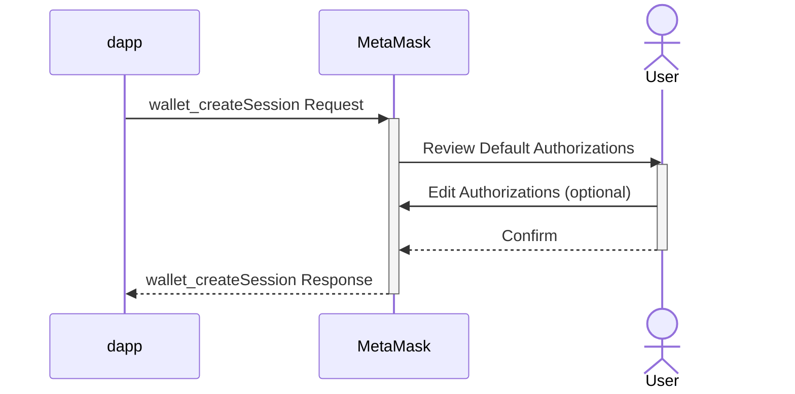

## Summary
This proposal recommends that MetaMask adopt a set of Chain Agnostic Improvement Proposals ([CAIPs](https://github.com/ChainAgnostic/CAIPs)) to guide the design of a new Wallet API that is generalized for interactions between dapps and wallets in a multichain environment. Implementing these standards encourages broad adoption while enhancing interoperability, improving user experiences, and significantly streamlining development for multichain dapps.

### Goals
- Consistent Structure: Provide common patterns while separating namespaces of each ecosystem or network.
- Interoperability: Employ standards to encourage the development of powerful libraries with support for multiple wallets and networks.
- Unlock the Design Space: Enable dapps to negotiate an interface with wallets for optimal multichain experiences.
- Extensibility: Make the API reasonbaly future-proof, allowing for new networks and methods to be added as demanded by the ecosystem.
- Security: Enhance security and privacy associated with wallets delived through Browser Extensions.

## Motivation
Valuable lessons have been learned from scaling the Ethereum dapp and wallet ecosystem. Now, a subset of [CAIPs](https://github.com/ChainAgnostic/CAIPs) offer a path to dramatically improve upon the prevailing patterns that had been established through [EIP-1193](https://eips.ethereum.org/EIPS/eip-1193) and [EIP-3326](https://eips.ethereum.org/EIPS/eip-3326) with chain-agnostic patterns that address long-standing issues. Furthermore, as decentralized networks continue to diversify, these patterns can be applied to non-EVM ecosystems so they can scale more efficiently and avoid common pain points associated with the demands of a growing dapp ecosystem that may require rapid evolution of Wallet APIs.

The Multichain API and associated CAIP standards promise to enable the following benefits for developers:
- Ability to interact with EVM and non-EVM decentralized networks through a consistent interface
- Employ interface negotiation patterns to adopt novel wallet features, while gracefully degrading for wallets that may not yet support them
- Ability to simultaneously interact with multiple networks
- Be notified of updates across multiple networks
- Elimination of excessive error handling involved with chain-switching across EVM networks

This proposal also generally encourages a privacy preserving and more secure alternative to provider injection (ex. `window.<provider>`) to establish communication between sites and browser extension wallets. 

## Usage Example

### Request
An example structure for a JSON-RPC request that a dapp would send to request authorization(s) from MetaMask:

```js
{
  "id": 1,
  "jsonrpc": "2.0",
  "method": "wallet_createSession",
  "params": {
    "optionalScopes": {
      "wallet:eip155": {
        "methods": ["wallet_addEthereumChain"],
      },
      "eip155:1": {
        "methods": ["eth_sendTransaction","eth_call","eth_getBalance","eth_blockNumber","eth_getTransactionCount","wallet_watchAsset","eth_subscribe"],
        "notifications": ["eth_subscription"],
      },
      "solana:5eykt4UsFv8P8NJdTREpY1vzqKqZKvdp": {
        "methods": ["signAndSendTransaction","signAllTransactions","signMessage"],
        "notifications": ["accountChanged"],
      }
      "bip122:000000000019d6689c085ae165831e93": {
        ...
      }
    },
    "scopedProperties": {
      // Scope-keyed proposals or declarations
      "eip155:1": {
        "extension_foo": "bar"    
      }
    },
  },
}
```

### Response
An example structure for the corresponding JSON-RPC response that a dapp would receive from the wallet:

```js
{
  "id": 1,
  "jsonrpc": "2.0",
  "result": {
    "sessionScopes": { 
      "eip155:wallet": {
          "methods": ["wallet_addEthereumChain"],
          "accounts": ["eip155:wallet:0x0910e12C68d02B561a34569E1367c9AAb42bd810"]
      },
      "eip155:1": {
        "methods": ["eth_sendTransaction","eth_call","eth_getBalance","eth_blockNumber","eth_getTransactionCount","wallet_watchAsset","eth_subscribe"],
        "notifications": ["eth_subscription"],
        "accounts": ["eip155:1:0x0910e12C68d02B561a34569E1367c9AAb42bd810"]
      },
      "solana:5eykt4UsFv8P8NJdTREpY1vzqKqZKvdp": {
        "methods": ["signAndSendTransaction","signAllTransactions","signMessage"],
        "notifications": ["accountChanged"],
        "accounts": ["solana:5eykt4UsFv8P8NJdTREpY1vzqKqZKvdp:7S3P4HxJpyyigGzodYwHtCxZyUQe9JiBMHyRWXArAaKv"]
      }
    },      
  }
}
```

# Proposal

## Language
The key words "MUST", "MUST NOT", "REQUIRED", "SHALL", "SHALL NOT", "SHOULD", "SHOULD NOT", "RECOMMENDED", "NOT RECOMMENDED", "MAY", and "OPTIONAL" written in uppercase in this document are to be interpreted as described in RFC 2119.

## Definitions

**Multichain API**: a new [Wallet API](https://docs.metamask.io/wallet/concepts/wallet-api/) that is generalized for interactions between dapps and wallets in a multichain environment

**network**: Decentralized networks where control, validation, and decision-making processes are distributed across multiple nodes rather than centralized in a single entity. The term will refer to a specific decentralized network that has a single unique identifier. Networks may be implemented as a blockchain or another distributed ledger technology. 

**node**: An RPC node that facilitates interactions with a decentralized network.

**Wallet API**: [The JSON-RPC interface](https://docs.metamask.io/wallet/concepts/apis/) that dapps can use to programmatically interact with MetaMask wallet clients.

**authorization**: A permission to access a resource over JSON-RPC.

**scope**: A uniquely identified domain for which authorizations can be applied (see [CAIP-217](https://github.com/ChainAgnostic/CAIPs/blob/main/CAIPs/caip-217.md) for further definition). 

**authorization scopes**: A set of objects that specify authorizations for each scope.

## Proposal Specification

As part of MetaMask's Multichain API implementation, MetaMask will adopt the following standards noting implementation-specific guidelines or differences:

### CAIP-2 - Network Identifiers
The network identifiers used in the routing of Multichain API calls will generally follow [CAIP-2](https://chainagnostic.org/CAIPs/caip-2) conventions and [namespaces](https://github.com/ChainAgnostic/namespaces). However, network identifiers may be extended directly through Snaps and may not be limited to [Chain Agnostic Namespaces](https://namespaces.chainagnostic.org/).

> **Note:** Supported namespaces may be limited. Consult the [MetaMask documentation](https://docs.metamask.io/wallet/reference/multichain-api) for the most up-to-date information.

### CAIP-25 - Negotiate Multichain Authorization Scopes
Multichain API connections will be established and updated through [CAIP-25](https://chainagnostic.org/CAIPs/caip-25) `wallet_createSession` calls.

> **Note:** A `sessionId` will not be returned in the initial response. Instead, the API will adopt session lifecycle management methods outlined in [CAIP-316](https://github.com/ChainAgnostic/CAIPs/blob/main/CAIPs/caip-316.md)

> **Note:** MetaMask treats `requiredScopes` as `optionalScopes`. Only `optionalScopes` are recommended, though `requiredScopes` can be used to signal that your dapp will not be usable if certain [CAIP-217](https://chainagnostic.org/CAIPs/caip-217) `scopeStrings` are not authorized. 

> **Note:** Developers are encouraged to precisely request only the authorization scopes for methods and notifications that their dapp expects to call before making additional `wallet_createSession` calls to expand authorization scopes. Requesting specific authorization scopes allows wallets to discover and implement features that are being adopted. Wallets can also further optimize permission confirmation flows to reduce unnecessary friction for some method calls. For simplicity, however, MetaMask may return more authorization scopes, methods, or notifications than the caller explicitly requested.

### CAIP-27 - Invoke RPC Requests for an Authorization Scope
A dapp can invoke RPC requests for an authorization scope by making [CAIP-27](https://chainagnostic.org/CAIPs/caip-27) `wallet_invokeMethod` calls.

> **Note:** a `sessionId` parameter is not supported and will be ignored, if included.

### CAIP-312 - Retrieve Authorization Scopes
A dapp can retrieve a [CAIP-312](https://chainagnostic.org/CAIPs/caip-312) multichain session object by calling `wallet_getSession` to request its authorization scopes at any time.

> **Note:** a `sessionId` parameter is not supported and will be ignored, if included.

### CAIP-311 - Notification of Changes to Authorization Scopes
A dapp can listen for [CAIP-311](https://chainagnostic.org/CAIPs/caip-311) `wallet_sessionChanged` events in order to get notified when there are changes to its authorization scopes.

> **Note:** A `sessionId` will not be included as part of the event.

### CAIP-285 - Revoke Authorization Scopes
A dapp can make a [CAIP-285](https://chainagnostic.org/CAIPs/caip-285) `wallet_revokeSession` request to revoke all of its authorization scopes.

> **Note:** a `sessionId` parameter is not supported and will be ignored, if included.

### API Specification Document
An OpenRPC [specification for the Multichain API](https://github.com/MetaMask/api-specs/blob/main/multichain/openrpc.yaml) can be found in the [api-specs](https://github.com/MetaMask/api-specs) repository.

## Caveats
The CAIPs referenced in this proposal are still in Draft or Review status with CASA and may be subject to material changes.

### API Access
As part of the Multichain API, MetaMask is leading the adoption of alternative methods for browser extension wallet communication. The current practice for browser extension wallets is to inject a javascript object in order to communicate with each site. But this approach comes with privacy, security, reliability, and performance drawbacks.

- The MetaMask Browser Extension will adopt an alternative method of communication through the [externally_connectable](https://developer.mozilla.org/en-US/docs/Mozilla/Add-ons/WebExtensions/manifest.json/externally_connectable) feature, which is now supported by most modern web browsers with extension frameworks.
- When a site is accessed through a browser that does not support [externally_connectable](https://developer.mozilla.org/en-US/docs/Mozilla/Add-ons/WebExtensions/manifest.json/externally_connectable), the Multichain API will be available through an alternative communication method. 

In summary, the following methods will solely be accessible through the new communication methods:

- `wallet_createSession` (CAIP-25)
- `wallet_sessionChanged` (CAIP-311)
- `wallet_getSession` (CAIP-312)
- `wallet_revokeSession` (CAIP-285)
- `wallet_invokeMethod` (CAIP-27)
- `wallet_notify` (CAIP-319)

(API Delivery & Wallet Discovery CAIPs to be added in this section)

### Snap Methods
Some RPC APIs associated with Snaps will be rendered redundant and will not be supported through the Multichain API. However, they will remain accessible through the EIP-1193 interface for backward compatibility.

**Discontinued Methods:**

- `wallet_requestSnaps`
- `wallet_getSnaps`
- `wallet_invokeSnap`
- `wallet_snap`

## Implementation
API Maintainers will implement the multichain interface in coordination with multiple MetaMask teams.
The Multichain API is intended to interoperate with MetaMask Snaps. See [SIP-26](https://github.com/MetaMask/SIPs/blob/ed17dd33713e6c2203f11b85ba655ae4acbcca7a/SIPS/sip-26.md) for a high-level overview of the anticipated architectural approach.

## Developer Adoption Considerations
Dapp developers are encouraged to use libraries to abstract the connection differences between wallet clients and to ensure their dapp stays updated as wallet-to-dapp communication methods continue to evolve.

## User Experience Considerations
Initial calls to the `wallet_createSession` method with `optionalScopes` that include any `eip155:[reference]` scopes will trigger a flow with this sequence:



> **Note:** There is no guarantee that an authorization request is surfaced in the wallet as **required**. Your application should gracefully handle situations where some authorizations submitted are denied even though the dapp may be considered to be connected to MetaMask.

## Privacy Considerations
It has become common for Browser Extension Wallets to require permissions that allow the extension to read and change all data on websites a user visits. Unfortunately, such a permissive privilege poses end-users with a significant risk to their privacy. While much of the ecosystem is now dependent on this pattern, we encourage web browsers, other wallets, and dapp builders to move in a the direction of avoiding such onerous browser extension permissions altogether.

## Security Considerations
This proposal is an opportunity to further incorporate the [principle of least privilege](https://en.wikipedia.org/wiki/Principle_of_least_privilege) in MetaMask at least at the API-level. [CAIP-25](https://chainagnostic.org/CAIPs/caip-25) is specifically designed around this principle.

The proposal also brings to light some security considerations critical to multichain interactions. These include the challenges of ensuring robust authentication and authorization and the importance that users understand the network with which they are interacting. Identifying and addressing these issues is vital for safeguarding users against the evolving landscape of security threats.

## References
- [CAIP-25](https://chainagnostic.org/CAIPs/caip-25)
- [CAIP-27](https://chainagnostic.org/CAIPs/caip-27)
- [CAIP-2](https://chainagnostic.org/CAIPs/caip-2)
- [CAIP-10](https://chainagnostic.org/CAIPs/caip-10)
- [CAIP-217](https://chainagnostic.org/CAIPs/caip-217)
- [CAIP-316](https://github.com/ChainAgnostic/CAIPs/blob/main/CAIPs/caip-316.md)
- [CAIP-312](https://chainagnostic.org/CAIPs/caip-312)
- [CAIP-311](https://chainagnostic.org/CAIPs/caip-311)
- [CAIP-285](https://chainagnostic.org/CAIPs/caip-285)

### Feedback
Submit feedback in the [discussion](https://github.com/MetaMask/metamask-improvement-proposals/discussions/53) for this MIP.

### Committed Developers
MetaMask

## Copyright
Copyright and related rights waived via [CC0](../LICENSE).