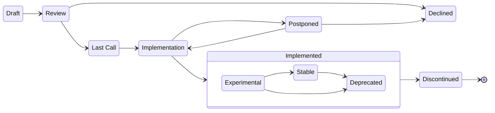

## Abstract

The "MIP" (MetaMask Improvement Proposal) process is intended to provide a
consistent, transparent, and controlled path for making changes to the MetaMask Wallet API.

## Core Aims and Approach
1. Establish a transparent process for MetaMask Improvement Proposals.
2. Prioritize feedback and improvements from developers who are actively integrating with MetaMask.
3. Ensure a committed set of developers are ready to adopt changes before investing time in implementation.

## Rationale
Many MetaMask changes, including bug fixes and documentation improvements can be implemented and reviewed via the normal GitHub pull request workflow. However, additions and significant changes to the **MetaMask Wallet APIs** are more sensitive because of the large number of developers and diverse applications that rely on these interfaces. For MetaMask, developer preferences on API designs and behaviors also need to be balanced against end-user experience, privacy, and security considerations. In addition, stability through backward compatibility in these APIs has been a key feature for scaling the ecosystem. 

To ensure that changes consistently adhere to our unique design principles, we have established a group of "MetaMask API maintainers" who are responsible for stewardship over the APIs. Some changes will be __initiated by the MetaMask API maintainers__. These proposals can be viewed as more of a "request for comments" among our developer community. 

At the same time, we recognize the diversity of thought and creativity across our ecosystem. Therefore, __we also encourage contributors outside of this group to submit proposals__. These proposals will require review and approval by the MetaMask API maintainers as well as an open period for comment by the developer community who may rely on the proposed interfaces.

## State of MIPs

If you're primarily interested in the latest production API, MetaMask provides a [machine-readable aggregation](https://github.com/MetaMask/api-specs) of all historical APIs and implemented MIPs that serves as a single source of truth.

For recently proposed or implemented modifications see the following lists:

[Active MIP List](http://insert.URL.here)

[Implemented MIP List](http://insert.URL.here)

[Declined MIP List](http://insert.URL.here)

## When to follow this process

Contributors must follow the MIP process in order to request additions or make changes to the MetaMask Wallet APIs that are in use by dapps.

Changes that do not require a MIP:

  - Fixes to make MetaMask Wallet APIs work according to their originally intended specification 
  - Wallet API usage, stability, or behavior clarifications in the technical documentation
  - Under-the-hood implementation changes that have no effect on MetaMask's Wallet API (could be for performance, security, maintainability, etc.)

## MIP Sources

Given all of the considerations involved, it is hard to write a MIP that would get quickly accepted. We still encourage those integrating with MetaMask to contribute because what you have in mind is often going to be something that others may be interested in as well.

In practice, MIPs will come in two flavors:

* **Maintainer MIPs** are submitted by API Maintainers after extensive (sometimes,
multi-month) design, discussion, and experimentation. The purpose of these MIPs is to preview the design
for the community and to provide an opportunity for feedback. We read every comment on the MIPs
we publish, respond to questions, and sometimes incorporate the feedback into the proposal.

* **Community MIPs** can be submitted by anyone. The guidelines provided here are meant to streamline the process by providing you with common considerations you'll want to ask yourself before submitting a PR for your proposal. However, initial Community MIP submissions are not expected to have all considerations addressed up front. The MIP process allows for periods of feedback and refinement before a proposal is accepted for official review.

Generally, we apply the same process and level of rigor both to Maintainer MIPS and Community MIPs. The primary difference between them is in the design phase: Maintainer MIPs tend to be submitted closer to the end of the design process whereas the Community MIPs tend to be submitted at the beginning as a way to kickstart a design discussion.

## Contributing

Please follow the steps in the [Contribution Guide](./CONTRIBUTING.md).

## Proposal lifecycle

- **Draft** - The initial proposal stage, indicating that the proposal is in development. The proposal will be submitted for review after being properly formatted. Major changes to the proposal are expected during this stage.
- **Review** - The proposal author(s) marked this proposal as ready for peer review. All members of the community are encouraged to participate. Incremental changes to the proposal are expected during this stage.
- **Declined** - The proposal may be declined for many reasons. Most common reason would be because it does not align with the design principles or long-term direction of the system and will not be considered for implementation. This status is final. If the idea is to be pursued again, a new proposal MUST be created.
- **Last Call** - The proposal has generally been accepted, but requires a period of further comment and feedback from the community prior to implementation.
- **Implementation** - The proposal has been accepted and is planned for implementation by a specific group. Only critical changes based on implementation experience are expected at this stage.
- **Postponed** - A proposal may be postponed if it is no longer planned for implementation or has not been actively developed for in 6-months. It may either be declined or remain in the postponed state until it is ready to move forward again.
- **Implemented** - The proposal has been successfully implemented. No signigicant updates except for errata and clarifications will be considered. The proposal MUST be fully implemented before being considered for this status. The stability of the implementation will be indicated by three sub-stages.
    **Experimental** - This status indicates that the implementation is not yet stable or finalized. Only early adopters who have committed to testing the proposal should build on the implementation. 
    **Stable** - The implementation has been validated and is considered stable. The proposal is considered final. No further updates except for errata and clarifications will be considered on the proposal. This status indicates that the implementation is ready for broad adoption.
    **Deprecated** - The implementation may emit warnings. Backward compatibility is not guaranteed and it may be discontinued at any time. Developers should use alternative methods or discontinue its use.
- **Discontinued** - Though one of the design goals is to maintain backward compatibility as much as possible, the implementation of the proposal may occasionally need to be completely discontinued for overall system maintainability or security reasons. We recognize that such changes may "break" legacy applications that are no longer actively maintained. This status is final.

## Implementing a MIP

The author of a proposal is not obligated to implement it. Of course, the
proposal author (like any other developer) is welcome to post an
implementation as a suggestion for review.

TODO: Add information about what's expected with MetaMask changes (ex. E2E Test Dapp)

## Inspiration

The MIP process owes its inspiration to the: [React RFC process], [SIP Process], and [EIP Process].

[React RFC process]: https://github.com/reactjs/rfcs
[SIP process]: https://github.com/MetaMask/SIPs
[EIP process]: https://eips.ethereum.org/EIPS/eip-1

Please share your feedback on this process. We're open to changing it based on contributor input.

## Copyright

Copyright and related rights waived via [CC0](./LICENSE).