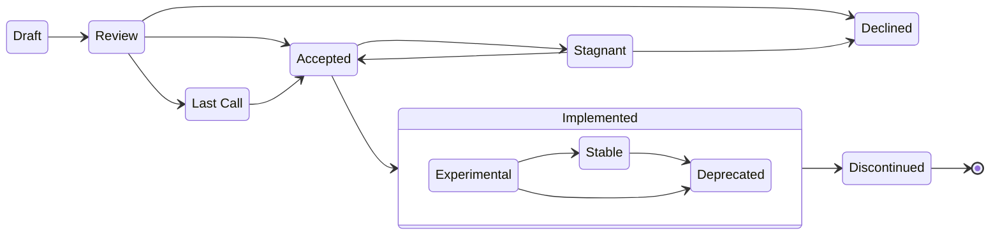

## Abstract
The "MIP" (MetaMask Improvement Proposal) process is intended to provide a
consistent, transparent, and controlled path for making changes to the MetaMask Wallet API.

## Rationale
Many MetaMask changes, including bug fixes and documentation improvements can be implemented and reviewed via the normal GitHub pull request workflow. However, additions and significant changes to the **MetaMask Wallet APIs** are more sensitive because of the large number of developers and diverse applications that rely on these interfaces. For MetaMask, developer preferences on API designs and behaviors also need to be balanced against end-user experience, privacy, and security considerations. In addition, stability through backward compatibility in these APIs has been a key feature for scaling the ecosystem. 

To ensure that changes consistently adhere to our unique design principles, we have established a group of "MetaMask API maintainers" who are responsible for stewardship over the APIs. Some changes will be __initiated by the MetaMask API maintainers__, which can be viewed as a "request for comments" among our developer community.

We also recognize the diversity of thought and creativity across our ecosystem and __encourage contributors outside of this group to submit proposals__. Proposals will require review and approval by the MetaMask API maintainers, as well as an open comment period from the community of developers who may be affected by the proposed changes.

## State of MIPs
If you're primarily interested in the latest production Wallet API, MetaMask provides a [machine-readable aggregation](https://metamask.github.io/api-specs/latest/openrpc.json) of all historical APIs and implemented MIPs that serves as a single source of truth. APIs are generated from the [api-spec repository](https://github.com/MetaMask/api-specs) and are represented as [OpenRPC](https://open-rpc.org/).

For recently proposed or implemented modifications see the following lists:

[MIP List](./MIPs/)
[MIP List by Status](./MIPs/mips-by-status.md)

## When to follow this process
Contributors must follow the MIP process in order to request additions or make changes to the MetaMask Wallet APIs that are available by default across all MetaMask clients (Browser Extension & Mobile).

> :bulb: Developers are strongly encouraged to first consider [MetaMask Snaps](https://metamask.io/snaps/)
> Developers can **permissionlessly** extend the Wallet API by [building a Snap](https://docs.metamask.io/snaps/how-to/develop-a-snap). Unlike MIPs, Snaps do not require a review process.

Changes that do not require a MIP:

  - Fixes to make MetaMask Wallet APIs work according to their originally intended specification 
  - Wallet API usage, stability, or behavior clarifications in the technical documentation
  - Under-the-hood implementation changes that have no effect on MetaMask's Wallet API (could be for performance, security, maintainability, etc.)

## MIP Sources
We encourage those who have a need for improvements to the MetaMask API to contribute MIPs as early as possible. Expect to spend some time getting your MIP reviewed and accepted before all of the considerations and feedback has been incorporated.

In practice, MIPs will come in two flavors:

* **Maintainer MIPs** are submitted by API Maintainers after extensive (sometimes multi-month) design, discussion, and experimentation. The purpose of these MIPs is to preview the design for the community and to provide an opportunity for feedback. We read every comment on the MIPs we publish, respond to questions, and sometimes incorporate the feedback into the proposal.

* **Community MIPs** can be submitted by anyone. The guidelines provided here are meant to streamline the process by providing you with common considerations you'll want to ask yourself before submitting a PR for your proposal. However, initial Community MIP submissions are not expected to have all considerations addressed up front. The MIP process allows for periods of feedback and refinement before a proposal is accepted for official review.

Generally, we apply the same process and level of rigor both to Maintainer MIPS and Community MIPs. The primary difference between them is in the design phase: Maintainer MIPs tend to be submitted closer to the end of the design process whereas the Community MIPs tend to be submitted at the beginning as a way to kickstart a design discussion.

## Contributing
Please follow the steps in the [Contribution Guide](./CONTRIBUTING.md).

## Proposal lifecycle
- **Draft** - The initial proposal stage, indicating that the proposal is in development. The proposal will be submitted for review after being properly formatted. Major changes to the proposal are expected during this stage.
- **Review** - The proposal author(s) marked this proposal as ready for peer review. All members of the community are encouraged to participate. Incremental changes to the proposal are expected during this stage.
- **Declined** - The proposal may be declined for many reasons. Most common reason would be because it does not align with the design principles or long-term direction of the system and will not be considered for implementation. This status is final. If the idea is to be pursued again, a new proposal MUST be created.
- **Last Call** - The proposal has generally been accepted, but requires a period of further comment and feedback from the community prior to implementation. It's best practice to include a Last Call, but some Maintainer MIPs may skip this stage.
- **Accepted** - The proposal has been accepted and is planned for implementation by a specific group. Only critical changes based on implementation considerations are expected at this stage.
- **Stagnant** - A proposal may be stagnant if it is no longer planned for implementation or has not been actively developed for 6-months. It may either be declined or remain in the stagnant state until it is ready to move forward again.
- **Implemented** - The proposal has been successfully implemented according to the specification in the MIP. The proposal MUST be fully implemented before being considered for this status. The stability of the implementation will be indicated by three stability levels.
    - **Experimental (1)** - This status indicates that the implementation is not yet stable or finalized. Only early adopters who have committed to testing the proposal should build on the implementation. Based on real-world usage, modifications may continue to be applied to the MIP.
    - **Stable (2)** - The implementation has been validated and is considered stable. The proposal is considered final. No significant updates except for errata and clarifications will be considered on the proposal. This status indicates that the implementation is ready for broad adoption.
    - **Deprecated (0)** - The implementation may emit warnings. Backward compatibility is not guaranteed and it may be discontinued at any time. Developers should use alternative methods or discontinue its use.
- **Discontinued** - Though one of the design goals is to maintain backward compatibility as much as possible, the implementation of the proposal may occasionally need to be completely discontinued for overall system maintainability or security reasons. We recognize that such changes may "break" legacy applications that are no longer actively maintained. This status is final.

## MetaMask API Maintainers
The role of MetaMask API Maintainers is to review MIPs and facilitate the MIP process (specifically the lifecycle state changes).

The current MetaMask API Maintainers are:

- [@adonesky1](https://github.com/adonesky1)
- [@Gudahtt](https://github.com/Gudahtt)
- [@shanejonas](https://github.com/shanejonas)
- [@jiexi](https://github.com/jiexi)
- [@vandan](https://github.com/vandan)

At least two of the maintainers have to approve any incoming pull requests that update files in the [MIPs folder](./MIPs).

## Implementing a MIP
The author of a proposal is not obligated to implement it. Of course, the
proposal author (like any other developer) is welcome to post an
implementation as a suggestion for review.

Implementors are expected to complete or otherwise coordinate and delegate the following tasks: 
- Implement the changes for both the MetaMask Browser Extension & Mobile app
- Update [api-specs](https://github.com/MetaMask/api-specs) with any API differences that arise during implementation
- Ensure that the API changes are testable by extending the [Test Dapp](https://github.com/MetaMask/test-dapp)
- Go through the regular PR review processes for each repository that needs to be modified
- Update MetaMask [technical documentation](https://github.com/MetaMask/metamask-docs) so that developers can use the new or modified capability effectively

## Inspiration

The MIP process owes its inspiration to the: [React RFC process], [SIP Process], and [EIP Process].

[React RFC process]: https://github.com/reactjs/rfcs
[SIP process]: https://github.com/MetaMask/SIPs
[EIP process]: https://eips.ethereum.org/EIPS/eip-1

Please share your feedback on this process. We're open to changing it based on contributor input.

## Authors
[@adonesky1](https://github.com/adonesky1), [@vandan](https://github.com/vandan), [@shanejonas](https://github.com/shanejonas), [@BelfordZ](https://github.com/BelfordZ)

## Copyright

Copyright and related rights waived via [CC0](./LICENSE).